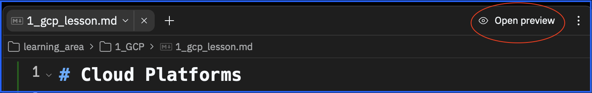
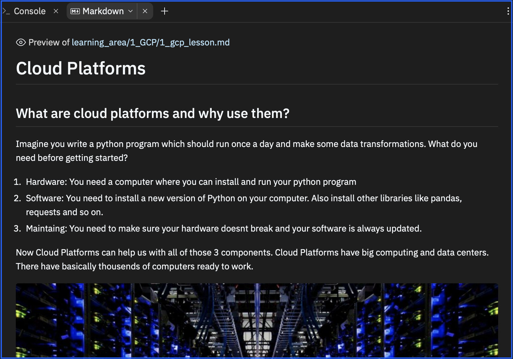

# Instructions  

### Requestions
Before we start, make sure you already finished the Replit "ETL - Shopping Mall".
Skills you should already have:
- read/write csv
- read/write sql
- pandas transformations
- Knowing the concept of an ETL

# Intro
Now its finally time to play around with real data from a real project. The data we will use is an anonymised sample from one of the biggest media companies. Lets call the company from now on "ConMedia".
Conmedia has many tv channels and websites. They show entertaning content, news, movies ans shows. There business model is simple. Companies who want to advertise ther product (we will call them "advertisers") pay ConMedia to show there advertisement on Conmedia tv channels or websites.

Back in the days ConMedia was using excel sheets and gut feeling to decide where an advertiser should place there advertisement and how much to charge for it. 
As part of a transformation to a more data drive approach ConMedia starts different data projects.

# Glossar
We are going to introduce new words. Most of them are specific to the advertisement business.
- Advertiser: This can be a company like "Adidas". They e.g want to advertise their new clothes.
- Stakeholder: A stakeholder are the people/companies who you create the project for. They define the requirements about what they want and when to deliver.Your job is to make them happy.
- Targeting groups: A targeting group bundles a group of people with specific characteristic into a group. Examples are: age, gender, income, interests.
- Impression: How many people/devices have seen an advertisement
- CTR: "click through rate": How many people people/devices have clicked on an aadvertisement.

# Business Case: Website Performance Report
You are a Data Engineer as part of the "Data Insights" department in ConMedia. Your Project Manager invites you to a meeting and explains you the new project which is called "Website Performance Report".

## Stakeholder
From now on we call our sales team our "stakeholder". The goal is to support our stakeholder with insights. Insights which help them when negotiating with advertisers about where to put which advertisement and what price to charge for it.

## Lets get Started
This time there is no predefined structure. No empty functions and no clear instructions how to code. You can build your ETL like in the previous chapter or use your own ideas.

# Import Data

## GCP (Cloud Platform)
Our first data source is GCP, a cloud platform. First lets figure out what GCP and Cloud Services are:

_**LESSON 1:**_
- Go through the lesson 1
- Make sure to use "Open preview", so you see the lesson in the right format.
  
 
 
- Make sure to click on the file "1_import_data/1_gcp_cloud_platform.md", so you see this lesson in the "Markdown" tab on the right. You should now see this:

## GCP Storage

Now we want to interact with a GCP cloud service called: GCP Storage in order to import data.

_**LESSON 2:**_
- Go through the lesson 2

## GCP Big Query

Now we want to interact with a GCP cloud service called: Big Query in order to import even more data.

_**LESSON 3:**_
- Go through the lesson 3

## Store Data in SQL

Now we want to store our data in our SQL database.

_**LESSON 4:**_
- Go through the lesson 4

  