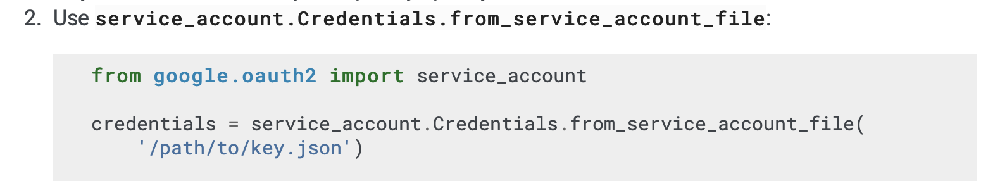
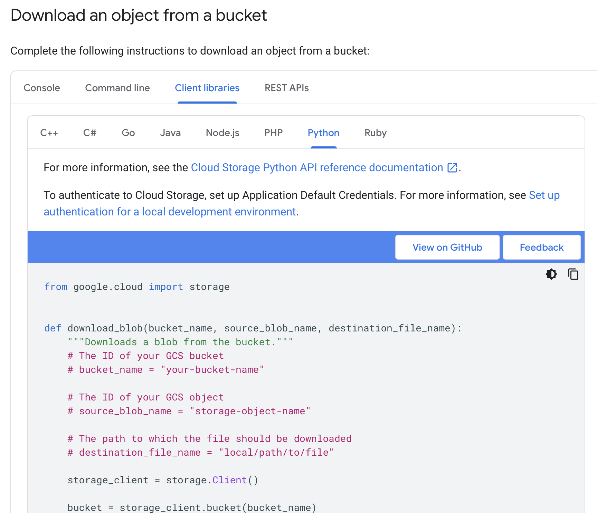

# Project: Netflix for Kids

### Stats
- Project Duration: 40 hours
- Project Difficulty: advanced

### What you will learn
- What Cloud services are (GCP)
- Import data from GCP Storage
- Import data from GCP Big Query
- What APIs are
- Import data from an API
- SQL: create relations between tables
- SQL: join tables
- SQL: create views
- ETL: clean/prepare data
- ETL: transform data
- ETL: provide data for a recommendation system
- Linux Shell: Run python program with parameters
- Bash Script: Run a linux bash script

### Requirements
Before we start, make sure you already finished the Replit "ETL - Shopping Mall".
Skills you should already have:
- read/write csv
- read/write sql
- pandas transformations
- Knowing the concept of an ETL

# Business Case
You are a data engineer/data analyst for Netflix. Netflix wants to focus more on content for children. Therfore it wants to create an alogorithm that recommends children specific movies.
Imagine there is an algorithmus in Netflix. Every time a kid opens Netflix it gives the kid automatically movie recommendations. In our business case Netflix still uses the same recommendation system for kids like for adults. This should be changed.

# Which movies do kids watch?
First of all, there are some movies kids are not allowed to see. For example violent content. Then there are also movies that kids are not interested in watching, for example old movies.
Also the Netflix research team has information about kids watching behaviour. For example they have a list of most popular directors for kids.
All this information we are going to use, to only have movies left that a kid likes to watch.

# Structure

You will go through all the chapters here step by step:

In those chapters there will be:
1) Explanations: Theory and concepts. They will look like this: "TASK 1 (CODING)"
2) Learning Tasks: Here you will test the concepts with coding. They will look like this: "TASK 1 (LEARN)"
3) Project Tasks: Here you will code on your project They will look like this: "TASK 1 "(PROJECT)"

When you open a chapter file, make sure to click on it. Then you will see in the "Markdown" tab on the right the content of this chapter. 

 

# Style Guidlines
Since our code gets more and more professional, we also want to keep up with higher code standards.

- Create small functions, that can be reused
- Create different python files for different areas. For example one for data import and one for sql ineractions.
- Describe your code with comments. Every funtion should have a docstring where you explain what the function does.
- Choose variable and function names that are also understandable for a new person

.

.

LETS GET STARTED!