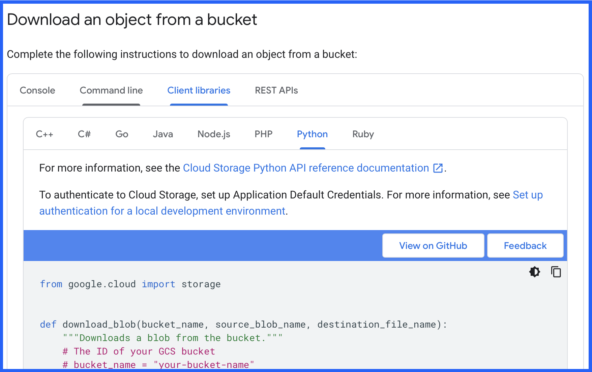
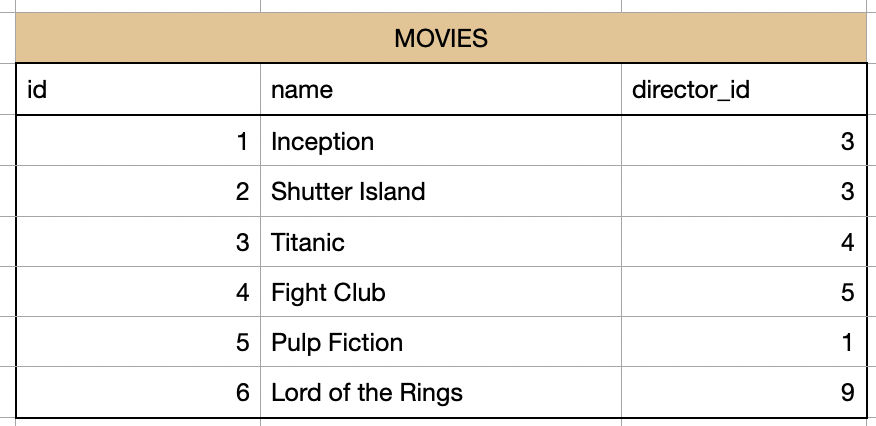

# Project: Netflix for Kids


### Stats
- Project duration: 60 hours
- Project difficulty: advanced


### What you will learn
- What is a Cloud services (GCP)
- Import data from GCP Storage
- Import data from GCP Big Query
- What is an API
- Import data from an API
- SQL: create relations between tables
- SQL: join tables
- SQL: create views
- ETL: clean/prepare data
- ETL: transform data
- ETL: provide data for a recommendation system
- Linux Shell: Run python program with parameters
- Bash Script: Run a linux bash script


### Requirements
Before we start, make sure you already finished the Replit "ETL - Shopping Mall".
Skills you should already have:
- read/write csv
- read/write sql
- pandas transformations
- Knowing the concept of an ETL

# Business Case
You are a data engineer/data analyst for Netflix. Netflix wants to focus more on content for children. Therefore, it wants to create an algorithm that recommends children specific movies.
Imagine there is an algorithms in Netflix. Every time a kid opens Netflix it gives the kid automatically movie recommendations. In our business case Netflix still uses the same recommendation system for kids like for adults. This should be changed.

# Which movies do kids watch?
First of all, there are some movies kids are not allowed to see. For example, violent content. Then there are also movies that kids are not interested in watching, for example old movies.
Also the Netflix research team has information about kids watching behavior. For example they have a list of most popular directors for kids.
All this information we are going to use, to create a list of movies for kids with a popularity score.

# Structure

We will have the following chapters you will go through:


In those chapters there will be:
1) Explanations: Theory and concepts. They will look like this: "TASK 1 (KNOWLEDGE)"
2) Learning Tasks: Here you will test the concepts with coding. They will look like this: "TASK 1 (LEARNING)"
3) Project Tasks: Here you will code on your project They will look like this: "TASK 1 "(PROJECT)"


# Style Guidlines
Since our code gets more and more professional, we also want to keep up with higher code standards.

- Create small functions, that can be reused
- Create different python files for different areas. For example one for data import and one for sql interactions.
- Describe your code with comments. Every function should have a docstring where you explain what the function does.
- Choose variable and function names that are also understandable for a new person


# LETS GET STARTED!

# Chapter 1) Cloud Platforms

## What are cloud platforms and why use them?
Imagine you write a python program which should run once a day and make some data transformations. What do you need before getting started?
1) Hardware: You need a computer where you can install and run your python program
2) Software: You need to install a new version of Python on your computer. Also install other libraries like pandas, requests and so on.
3) Maintaining: You need to make sure your hardware doesn't break and your software is always updated.

Now Cloud Platforms can help us with all of those 3 components. 
Cloud Platforms have big computing and data centers. There have basically thousands of computers ready to work.


So now imagine instead of running your python program on your computer you let it run on a computer on a cloud computer. What are the benefits?
1) Your computer could break, get stolen. A cloud computer is save from damage.
2) Your computer GPU and memory is limited. If you have a complicated program which needs a lot of resources, your computer might be not good enough.
3) Could platforms also manage software for you. They can give you access to a computer which already has installed everything you need.
4) If the software need updates, they take care of it.

So basically, you can outsource hardware and software infrastructure almost completely. The only thing you need is a internet connection to access it.

## Companies using cloud platforms
Of course for a single person, with a single python program there is no necessity to use a cloud platform.
But now imagine you are a big company with many databases, programs, AI models. You need to buy all the computers and put them in your office, or somewhere. Then you need an IT department which makes everything work, installs and maintains all the software. Those are a lot of fix costs and a big initial investment. Also its not very scalable. If you suddenly need much more or much less resources you are not very flexible to adjust.


Here is a good video which explains the benefit of using cloud services instead of on premise solutions:
https://www.youtube.com/watch?v=1ERdeg8Sfv4


## Cloud Platform Provider

Now you know what the general concept of a cloud platform is. There are endless different cloud platforms. But there is a handful of big and most popular cloud platforms
1) AWS
2) GCP
3) Azure
4) IBM

All of them offer basically very similar services. But all of them have some benefits. While AWS is the most used platform, GCP is more user and beginner friendly and the best way to get started.


## GCP (Google Cloud Platform)

So, we are going to work with GCP.
GCP has different services which offer you to some degree hardware, software and maintenance and an easy interface.

Some important solutions for a data engineer:
1) Storage: A service to store files.
2) Big Query: A scalable database for BIG Data
3) Composer: A service which helps you to schedule your ETL tasks (Airflow).


# Chapter 2) GCP Storage

First of all, we are going to explore the most simple service: Storage. what is it? Like the name says its a service from GCP where you can store files. 
I created a GCP account and uploaded a file into GCP storage. Now you are able to download this file. But in order to download it you need 3 informations.

1) The path where to find the file
2) Permissions to read and download this file
3) A Python library to execute the download

### 1) Path of the File
Imagine GCP Storage works like the directory on your computer. So we need the "directory" where to find the file and the name of the file. To locate a file in GCP storage you need:
- Project Id: This is where all the GCP resources of a specific project are bundled
- Bucket name: Think about it as the directory on the first level. That where we start to look.
- File path: This is the exact path of the file inside the bucket.

So now you can say to google: Look into the project "python-rocket-1". Go into the bucket "python-rocket-source-data-4s23" and give me the file "etl-netflix/netflix_shows.csv".

### 2) Authorization
Now you have the information where to get the file. But you don't have the permissions yet to read it. 
Me, who created this bucket and file can control who is allowed to read this file.
There are different authorization concepts, we will learn about more later. Just keep in mind, that you always have to think, am i authorized to execute this action (for example read and download this file).

One way to authorize yourself is by using a "service-user". Think about it as a json file where the username and the password are stored.  You can check out a service-user here: "program/authorization/service_user_read_file.json". Everyone with this file, can now read specific files from my GCP cloud project. 

### 3) Python Library
Now we can download this file with different programming languages. Since we write in Python, we want to use the library to interact with GCP Storage. This Python library uses the term "blob". It stands for "binary large object". In other terms, its a file stored in binary. You will see it in the following task.


## Download file from GCP Storage
### TASK 1 (PROJECT):
Now we want to download our first data from Netflix.
- Read the official GCP documentation how to download a file from GCP storage and use the python code as a first template: https://cloud.google.com/storage/docs/downloading-objects#client-libraries-download-object
This code here:

- Use this function in our main file.
- Define the 3 parameter which are used in the function. There are explained in the function.

1) bucket name is: "python-rocket-source-data-4s23"
2) gcp file path is: "etl-netflix/netflix_shows.csv"
3) destination path: program/data_sources/netflix_shows.csv

- Execute this function. If everything went well, you now should get a permission error. Because you still don't have the permission to read the file. The error should look like this at the BOTTOM:


### TASK 2 (PROJECT):
Now we need to adjust the code, to specify the project id. GCP needs this information to know where to search for the bucket and the file. In function to download the file, we use this command:
"storage.Client()". This creates the connection the GCP storage. Now we need to add the project id as a parameter. 
- Check out the documentation about the method "Client()": https://gcloud.readthedocs.io/en/latest/storage-client.html
- Now use the projectid: "python-rocket-1" and execute the code again.
If you did everything right now you should get a NEW error which looks like this at the BOTTOM:

The error message is (like often) not saying much. But the error appears basically because we didn't authorize ourselves, so we still have no permissions to download the file. This error message is a message that GCP sends us as a response.


### TASK 3 (PROJECT):
Now we need to add authorization in our code. I told you before that on way is to use a json file with the credentials of a service-user.

- Read this documentation https://googleapis.dev/python/google-auth/1.7.0/user-guide.html and figure out how to read our service account file ("program/authorization/service_user_read_file.json") and store the credentials in a variable. Use this code example.

- Check the documentation https://gcloud.readthedocs.io/en/latest/storage-client.html again and first figure out if our method "storage.Client()" has a parameter for authorization
- Now use this variable with our credentials in our code to authorize us.
If everything worked, you now should have no errors anymore. Also now you should see the csv "program/data_sources/netflix_shows.csv". Check if it has data inside. If not, something still went wrong.


# Chapter 3) Big Query

You should be already familiar that we can store data in a sql database.

GCP has a very popular service which looks and works very similar as a sql database: Its called: Big Query.


## Lets check out how Big Query looks like

This is how Big Query looks in the browser.
In this case we see a dataset with the name "etl_netflix" and a table with the name "ratings". We can group many tables in one dataset.


Lets take a look into our table called "ratings".
You see it looks like a sql table or a pandas dataframes. You have columns and you have rows. In this case we have 2 columns (id and rating)


You can even query the table with SQL queries you already know.
Here the SQL query:


Here the result:


You see that you can use Big Query AS IF it is a normal sql database. You have tables, with columns and rows. You can use most SQL operations that you know in order to query this data. Also, you don't have to install any software of setup anything. You can just start to create tables with data right away.


## What happens under the hood of Big Query?

But, under the hood a lot of magic happens. Especially in use cases where you have BIG DATA (Terabytes of data) a SQL database can come to its limit and not perform well. Big Query can handle large datasets very easily. The resources used are scaled automatically. So in theory you have endless computing power. 
Also it is a managed service, so you don't need to take care of the software underneath or worry about updates and infrastructure.
!BUT: You have to be careful because of possible high costs. When you accidentally make a very complicated data on huge datasets this can cost a lot of money. In our lesson we only use small data and standard queries.


### TASK 4 (LEARNING):

We will now learn how to use pandas, to read directly from a big query table.
Information you need:

- Check out the documentation how to use pandas to read directly from a big query table: https://pandas.pydata.org/docs/reference/api/pandas.read_gbq.html
- Use pandas to read the big query table "ratings" from the dataset "etl_netflix" from the project "python-rocket-1". Store the dataframe as a csv here: "program/data_sources/ratings.csv". Rename the column "ratings" to "name"
- Check out an example query here: https://cloud.google.com/bigquery/docs/samples/bigquery-pandas-gbq-read-gbq-simple
- Here again we need to add authorization. This time use the following service user which has the permissions to tead the table: "program/authorization/service_user_read_bigquery.json". Use the same approach like with GCP Storage authorization.
- If you get an error like this don't worry. Just make sure you downloaded the file and it has data in: program/data_sources/ratings.csv


# Chapter 4) API

## What is an API?

Here is the most used analogy, so you get a first intuition what an API is:

An API is like a waiter in a restaurant. When you go to a restaurant, you don't go directly into the kitchen and cook your own meal. Instead, you interact with the waiter who serves as an intermediary between you and the kitchen.


## Usage of APIs
There are a lot of technical explanations. But lets first keep it simple.

Lets see, how to use an API.

When you open your browser and for example type in this url: https://open.er-api.com/v6/latest/USD

Then you don't see a website, like usually. Instead you now get a result that looks like this:


What happened? You successfully called your first API and received a response.

So, what happens in the background? The API is a program which is running on a server. The program can be reached over a specific url (in this case: https://open.er-api.com/v6). In our example you see, that we also added to the url "latest/USD".
This is called an endpoint of an API. By calling this specific endpoint we tell the API that we are interested in the latest exchange rate for the USD. This is why as a response we get a json, where we see all the exchange rates for the USD.

If we now for example want the exchange rate for the EUR, we call this endpoint:
https://open.er-api.com/v6/latest/EUR

When interacting with an API we need to know which different endpoints are available and which information we get from there. This is why every API should have a documentation where it shows how to interact with it.

## Usage of APIs (with a python program)
In this example we used the browser to call an API. In most cases we will call the API from our program. So, we will write python code, which will call this endpoint and then receive a response.
Almost with every programming language you can call an API.

## Programming an API

### Hosting
So, how was this API created and how does it work?
In general you can create an API in many different programming languages, like Python.
For Python there are popular frameworks like: fastapi, flask, flacon, django.

So, you create for example an API by writing Python code and using the module fastapi. As a next step you need to make the API accessible over the internet. Thats why you need to expose it to a URL. Then it can be reached by everyone using this URL.

### Logic
When designing an API you usually think about input and output. You give the user specific endpoints he can call. And you then decide which output you give the user as a response. So more concrete:
1) You define different endpoints (e.g: https://open.er-api.com/v6/latest/EUR)
2) You create a logic: Every time someone calls this url you start a function in your python code, e.g: "get_exchange_for_euro()".
3) The function then for example connects to your sql database, where you have stored the current exchange rate.
4) The result from the sql database is then transformed into a JSON and is send as a response back to the user.


### Authorization
In this example we used a public API with no authorization. This means, everyone can call this API. Usually an API requires some kind of authorization. This can be a username and a password. But the most common approach is to have a API-KEY. This is like a password that you send with your request.

This api for example requires authorization.(https://api.api-ninjas.com/v1/animals?name=dog)

When you call it you receive an error message:


### Accessibility
The APIs we will use are accessible for everyone. Some of them don't require any authorization and some require an authorization. But in general there are open to the use for all people and programs.

But the most APIs in the business world are only used internally inside a company. For example when you open the Instagram app. The app then calls one of the instagram APIs. For example they might have an API, that handles to get the newest instagram stories and send it to your instagram app.
In this case, you as a user don't use this API. Its used inside the instagram architecture.


### Benefits of an API
So, what are the benefits of the API?
The API is a middleman between the user and the data. The user doesn't need to connect to a database, find the right tables and format the result. The user only has to know which endpoint (url) he has to call. The API then handles everything for him.
So, here more concrete:


1. Middleman: APIs help different services (programs) to communicate with each other. Its like a common language every service understands.
2. Authorization: APIs can check what a specific user is allowed to see.
3. Hide Complexity: As a user of an API you don't need to understand the backend, foe example the sql database. 
4. Easy to use: Calling a url is easy. Thats why it is very easy to integrate in your program.
5. Scalable: When its hosted properly it can handle many requests in parallel
6. Documentation: Every good API should have a good documentation. To use it you don't need to talk to tis developer or see the API code.
7. Accessible via https: This means, that you can call an API like you call any other url on the internet.

### Programming an API?
Creating an API also is part of the work of a data engineer. So, later you will learn how to create and host an API. But for know, we concentrate on how to use APIs.


### Task 5 (LEARNING):
Now lets call an API and see how it works.
- go through the file "learn_area/call_api.py". Make sure to execute every command yourself and play around with it.


## Back to our Netflix Project
Remember, we want to optimize the content for kids on Netflix.
The research team from Netflix figured out, that movies which where produced in countries with a lower GDP/capita (Gross domestic product per person), are not so popular for most kids.

In our data we already find the name of the country where the movie was produced. Now we still need the information about the GDP/capita of those countries. To get this information, we will call a free API.

### Task 6 (PROJECT):
Lets first create a list with all countries we have.
- Get all unique countries from the file "program/data_sources/netflix_shows" and store the result in a list.
- Be aware, that sometimes we have many countries for one movie. But we want a list of all unique single countries.


### Task 7 (PROJECT)
- Check out this video: https://www.youtube.com/watch?v=OVvTv9Hy91Q
- Create a free account at ninja API (https://api-ninjas.com)
- Check out the documentation how to use the "country" API: https://api-ninjas.com/api/country
- Use the country list you created in the task before.
- For every country in that call the API and get the GDP/capita.
- Create a CSV "program/data_sources/gdp_per_capita.csv where you have for each country its GDP/capita value and call the column "gdp_per_capita"
- When creating your function, which calls the api: Add a optional boolean parameter "is_test". When this one is set to true, the function should only call the API for the first 10 countries of the list. This will allow you to test your code without every time making an API call for every country in the list.


# MILESTONE 1
Now we have imported all the data that we need. We used Storage, Big Query and an API to get all the data that we need.
Now lets move on to work with the imported data.


# Chapter 5) SQL Relations

You already know how to save a table in a SQL database. Now we want to add some more knowledge about SQL tables.

One of the big benefits of a SQL database is that it is a "relational" database. What does that mean? 
It means that in SQL we have to define relations between different tables. This can give the user a better understanding how all the data is related. And it also makes the process of searching or changing data much more efficient.

Imagine we have 2 tables.

Table 1: "DIRECTORS"


Table 2: "MOVIES"


Now how are those 2 tables related?
You can see, that the table "MOVIES" has a column "director_id". With this id we can look into the table "DIRECTORS" and figure out the director name. For example the movie "inception" has the director_id "3". In the table "DIRECTORS" we search for the id "3" and find the name "Christopher Nolan".

SO the first thing that we figured out is that that both tables are related through those columns:
MOVIES.director_id <--> DIRECTORS.id

Now as a next step, we want to know more about the relationship. In general here are the relationship types:
- 1 <--> n (1 to many)
- n <--> 1 (many to 1)
- n <--> n (many to many)
- 1 <--> 1 (1 to 1)

For example "1 <--> n" means that 1 row from the first table can have many related rows in the second table. But one row from the second table can only have 1 related row from the first table.

Lets check out our example tables. We have movies and directors. Now think about it logically. How many directors can one movie have? And how many movies can one director have? Before continuing to read, try to figure it our yourself.

The answer is...

One movie can only have one director. But one director can have many movies (e.g Christopher Nolan).
Thats why we have the following relationship:

- MOVIES.director_id <--> DIRECTORS.id
- n <--> 1 (many to 1)

We could of course also define it the other way around.
DIRECTORS.id <-->  MOVIES.director_id
1 <--> n (one to many)

## SQL Keys (Primary, Secondary)

Primary Key: A primary key is a column which has only unique values. One value cant be twice in the same column. The value of the primary key identifies exactly one row of the table. It is usually a number, in most cases an ID.

So, what is the primary key in both tables? Before continuing to read, try to figure it our yourself.

The answer is...

In the first table "DIRECTORS" its very easy. The primary key is the column "id".

In the second table its more complicated. We have two columns with an id. So, which one is it?
The column director_id sounds like an "id". And it also has numbers. BUT: We see, that the id is not unique here in this table. For example the id "3" we have in the first and second row. The column "director_id" is the column that we use to connect to the table "DIRECTOR" where the same number is the primary key.
This is why we call the column "director_id" in the table "DIRECTOR" is a foreign key.

Foreign key: A column which makes it possible to connect to another table where the same column is a primary key.

So, to summarize. In our example:

Primary keys:
DIRECTORS.id
MOVIES.id

Foreign keys:
MOVIES.director_id

Relation:
MOVIES.director_id <--> DIRECTOR.id
n <--> 1 (many to 1)


In SQL there is a way how to visualize relations between tables. Here is a visualization of the example you just created. We see 2 tables and their columns. The key symbol shows you the primary key. The arrow shows which columns are connected. The 1-n shows or one to many relationship.


## SQL Relations Tasks

### TASK 8 (THEORY):

I already explained you the main concepts of relationship. But in addition to that here is more material.
- Check out this video here:  https://www.youtube.com/watch?v=4q-keGvUnag
- Explain with your own words and write it in learn_area/your_answers.txt: what are relations? what are the primary key and foreign key? which relation types we have between 2 tables? Use the knowledge from my explanation and the video.


### TASK 9 (LEARNING):

Now lets test your knowledge and create your own relations between tables:
- Check out this documentation about how to create a primary key in a table with sqlite: https://www.techonthenet.com/sqlite/primary_keys.php
- Check out this documentation about how to create a foreign key in a table: https://www.sqlitetutorial.net/sqlite-foreign-key/
- Open the file learn_area/sql_relations.py and follow the instructions.


### TASK 10 (PROJECT):

Now lets continue on our ETL project. 
- Create a SQlite database: "program/database/netflix_database.db"
- Create a SQL table for each of the 3 csvs, with the names (NETFLIX_SHOWS, RATINGS, GDP_PER_CAPITA)
- Make sure to define the data SCHEMA yourself with the "CREATE TABLE" statement. 
- Make sure to add Primary and Secondary Keys
- Check now if everything was created the way we want it. For that execute those functions (you find them in the module "program/helper_functions.py") in your program:
1) All tables: show_all_tables()
2) Table schemas: show_table_schema()
3) Relations: get_relations()
You can use those helper functions, to check your results...
- Insert the data into the tables.
- Now check if we have data in all our tables with the helper function "show_data_from_table()" 
- Create a diagram for the sql relations and save the image in the folder "program/graphics".  For that you can use some drawing tool or for example a free tool like: https://app.diagrams.net There are many other more modern free tools where you just need to create an account. Or you just use paint, powerpoint..


# Chapter 6) SQL Joins

Now back to our learning example. We have the 2 tables "DIRECTORS" and "MOVIES". We already know the relations. But now we want to combine their data.

In SQL you combine tables by using JOINS. There are endless tutorials about JOINs. Feel free to check them if you want or need a deeper understanding. At this point i will tell you only as much as you need to continue.

In SQL there are different JOINS. The most important once that you need to know at this moment:
1) LEFT JOIN
2) INNER JOIN


Remember our tables:

Table 1: DIRECTORS


Table 2: MOVIES


### SQL LEFT JOIN

Now lets say, we want to know for every movie the name of the director. In table 1 we have the name of the director. But in table 2 only the director_id.

In the end we want a result which looks like this:


Here you we see every movie and the name of the director of the movie. We also see 2 more things:
1) Every row from the table "MOVIES" is still there.
2) For the movie "Lord of the Rings" we didn't find a director_name. So, there we have a NULL value (which means "empty", like "None" in python). 


The right graphic illustrates a LEFT JOIN. "Table1" is our "MOVIES" and "Table2" is "DIRECTORS"


So, how can we combine both tables together like this in SQL?

Yes, with a JOIN. More concrete a LEFT JOIN Here is the command we need to execute to get the resulting table:

```sql
SELECT m.id, m.name, m.director_id, d.name as director_name
FROM MOVIES as m
LEFT JOIN DIRECTOR as d ON m.director_id = d.id
```

What does this query do? This is how you should read it:
1. We select our first table "Movies" with "FROM Movies".
2. Then we decide which other table we want to JOIN. In this case we JOIN "DIRECTOR" with "LEFT JOIN DIRECTOR".
3. We say please join the tables where the column "director_id" from the table "MOVIES" equals the column "id" from the table "DIRECTOR" (m.director_id = d.id). Remember here we have our relation.
4. WITH the "SELECT" we define which columns of each tables we want to display.


Lets take a look back at our table. In our case of the LEFT JOIN the table "MOVIES" is on the left. This is always the table that we call after the "FROM".
- All the rows from the left table will still be in the result.
- When a row from the left table has cant find any value after the JOIN (in this case Lord of the Rings cant find a director name) we get a NULL value.

### LEFT JOIN (the other way around)
You might have realized that we lost some data when we did that join. We cant see the director "Martin Scorsese" with the id "2" anywhere in our result table. This is because no movie of the "MOVIES" table has the director_id "2" for "Martin Scorsese".

Lets say we now want it the other way around. We want to make sure to see all directors. And for ever director we want to join the movies they directed.

We want a table that looks like this.


Here you can see:
1) We see every director, even Martin Scorsese.
2) For Martin Scorsese there is no movie, so there is a NULL value for the column "movie_name"
3) We now have 2 rows with the director "Christopher Nolan". This is because we have 2 movies that he directed.


This would be the query:
```sql
SELECT d.id, d.name, m.name as movie_name
FROM DIRECTOR d
LEFT JOIN MOVIES m ON d.id = m.director_id
```

1) We now change the order of the tables. Now "DIRECTOR" is on the left.
2) We join still with the same condition.
3) We choose other columns that we want to display


CONCLUSION: When you use a LEFT JOIN, for the LEFT table we will have all rows. For the RIGHT table only the values, that we where able to map to our LEFT table.


### SQL INNER JOIN

As you can see in the first LEFT JOIN we would still have the movie "Lord of the Rings" even though it has no director. 

In the second LEFT JOIN we would still have the director "Martin Scorsese" even though he has no movie. 


But know lets say, we want only rows where we find a match in the other table. We don't want those 2 cases with NULL values.

We want this result:


For that we need to use a INNER JOIN. The query will look like this:
```sql
SELECT m.id, m.name, m.director_id, d.name
FROM MOVIES m
INNER JOIN DIRECTOR d ON m.director_id = d.id
```
1) Everything is like in the first LEFT JOIN example. The only difference is that we now use "INNER JOIN" instead of "LEFT JOIN".
2) When using an INNER JOIN it doesn't matter which table is on the left or on the right. You can change the tables and still get the same result.
3) We now only get rows where we can find the id that we join on in BOTH tables.

## SQL JOIN Tasks

### TASK 11 (LEARNING):
Now you will do your own JOINS. 
- Go through the file file learn_area/sql_joins.py


### TASK 12 (PROJECT):
Now lets use JOINS in our ETL project.
- Create a new table "NETFLIX_META_WITH_RATING". For that JOIN 2 of the tables so we get the following: We want all rows and columns from the table "NETFLIX_SHOWS". But for the column "ratings" instead of the number we want the actual name of the rating.

# Chapter 7) SQL Views

You already know what "Tables" are. In SQL we also have VIEWS, which are a very popular concept. But what are views?
Think of a view as a saved query that you can treat as a table.
Lets say you use the inner join from above. But this time we also add a "WHERE" condition. We want to filter for movies from "Christopher Nolan":

```sql
SELECT m.id, m.name, m.director_id, d.name
FROM MOVIES m
INNER JOIN DIRECTOR d ON m.director_id = d.id
WHERE d.name = "Christopher Nolan
```

You can just execute the query and the result would look something like this. We would have only those 2 rows.


Now we could take the result and load it into a pandas dataframe and then work with the data. But lets say, we want to execute the JOIN many times in our program. And also our program will run once a day.

Instead of every time using this sql query and execute it, we can instead save the SQL query in a view. Lets first check the code. It is the same sql query. we just added "CREATE VIEW MOVIES_NOLAN AS". 

```sql
CREATE VIEW VIEW_MOVIES_NOLAN AS
SELECT m.id, m.name, m.director_id, d.name
FROM MOVIES m
INNER JOIN DIRECTOR d ON m.director_id = d.id
WHERE d.name = "Christopher Nolan
```

Now in your dataset you would see the view, like all the other tables you have.


You can now use it as if it is a table. You can for example use this query like with a normal table.

```sql
SELECT name
FROM VIEW_MOVIES_NOLAN m
```

And you will get the data:


So, what makes a view different then a table?
1) We don't store the data of the view. We only store the sql query. Only then when we query the view, the sql query of the view will be executed. This results in lower storage costs.
2) Views are dynamic. The data we get from a view changes when the underlying data of the tables the views refers to is changed. So in our example above. When the data from the table "MOVIES" changes, the data we get from the view "MOVIES_NOLAN" also automatically changes.
3) Performance is worse. Understand, that querying a view involves executing the underlying query logic each time the view is accessed. This can take more time then if the data of the view would already been stored in a table.
5) Better overview: Since in SQL we separate data in different tables with relations, it can be hard to get an overview how to combine which tables (especially if you have more 10 or 20 tables. Creating views makes it much easier for the programmer to interact with the data and get what he needs.

### TASK 13 (LEARNING):

Lets now create our own views.
- Follow the instructions in "learn_area/sql_views"


### TASK 14 (PROJECT):

Now lets use views in our project:
- Create a View with the name "VIEW_NETFLIX_SHOWS_WITH_RATING". This VIEW should have the same join that we used for our joined table "NETFLIX_SHOWS_WITH_RATING"
- Make sure you don't have any column duplicates after the join. 
- Query the VIEW to see if the result is like intended.

# MILESTONE 2
Now we have stored our data in a database with relations and we created useful views that we can use from now on. Now lets actually take a look into the data inside, clean and transform it.


# Chapter 8) Data Cleaning/Preparing

Before we use the data, it is important to clean and prepare it. Here are some things we should consider
1) Do we want to remove or change specific values?
2) How do we threat NULL or empty values?
3) Do we want to drop specific columns?
4) Do we want group some values into categories?
5) Do we want to add any columns?

Lets get started!

### TASK 15 (PROJECT):
Now lets create a table with our cleaned data.
- Write a SQL Query to create a table "NETFLIX_COMBINED_CLEANED".
- Use the VIEW we created as an input
- Remove rows where the the column "cast" is empty
- When in the column "country" is no value that put it to "unknown".
- When we have in column "country" many countries then replace them with "many"
- We have a bug in the column "title". Sometimes we have the following text: "<TITLE>". Remove this from every row.
- Add a new column with the name "release_2000_or_newer". When a movie was released 2000 or later then there should be the value "yes". If its before 2000 there should be the value "no"
- In the end the schema if the table should be the same like in the view, only with one more column added in the end.

# Chapter 9) Data Transformation


Now that have cleaned and prepared our data. We can start to add some transformations for our business case. We did our cleaning with SQL queries. The transformations we will make with pandas in python. Remember the end goal is to have only movies which kids can watch and rank them by popularity.

### TASK 16 (PROJECT):

First of all, want to remove movies which are not good for kids, by using pandas.
- Create a pandas dataframe with:
- Filter out movies where the rating says its not for kids.
- Remove all movies which are about war or violence.


### TASK 17 (PROJECT):
Now we want to mark movies which are likely to be popular for kids:
- use the dataframe you created
- Add a column "popularity" (it will have values from 1 to 3)
- We have a list of directors which are very popular for kids. Those directors are in the file "popular_directors.csv" Every movie with one of those directors should get a popularity of 3.
- Check the GDP of every country (using our csv "country_gdp.csv"). Every country with a gdp lower then 30000 should get a popularity of 0.
- All remaining movies should get a popularity of 2.
- Check how many shows have which popularity.
- save the final dataframe as a sql table "SHOWS_FOR_KIDS_RECOMMENDATION" which contains only 3 columns. show_id, title and popularity.
- save the final dataframe as a csv "program/data_export/shows_for_kids_recommendation.csv"


### TASK 18 (PROJECT):
Now its time for your ideas.
- Implement at least 2 more ideas how to figure out which movies are good for kids. Use your creativity. Here you can do some research or add some other information or data you find. 
- Save the result in a new SQL table and csv


# Chapter 10) Recommendation System

So, how can our result now be used for recommendation?

Remember that in our business case Netflix uses an algorithms that gives every kid a recommendation which movie to watch. Before our project Netflix was using the same recommendation algorithm for kids like for adults.

This now can be changed. We now created data which includes only movies for kids and ranks them with a popularity.

So can will the Netflix algorithm now use our data?

Imagine this: every time a person opens Netflix, Netflix first checks if this is an adult or a kid. If it is a kid, the algorithm will connect to our database and check which movies are the most popular. Then it will use this information to recommend specific movies. Maybe this algorithm will also consider other information, like the user behavior of the child. But this is not information that we provide. We only provide the information which movies are popular for kids in general.

You see, this is NOT the typical data use case where we created a dashboard that some manager will read in order to make some business decisions. This time we created data which will be automatically used by another program (the Netflix recommendation system). 

Although we now cant see our result in a dashboard, the effect of our data can be very big. 

After 2 months of testing, Netflix concludes, that using our data for kids movie recommendations, we could increase the average watching time by kids by about 10%. This has a worth of 50 mil. dollars.

Netflix is very happy about that and decides to invest even more in data projects!


# Scheduling ETL

So now we click the "RUN" button and we get our result. So, why might it be a good idea to schedule our program and for example run it once a day? Think about the data that we use for our recommendation. Which data could be different tomorrow then today and how might it change?

### TASK 19 (PROJECT):
- write your answers into "learn_area/your_answers.txt"
- list possibilities which data could change and how
- explain why it is important that our ETL runs every day and updates its results.
- At which time should we schedule our program once a day? What does it depend on?
- Which changes in the source data could break our program? Which changes should we be aware about?

