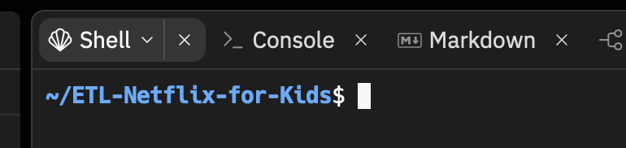
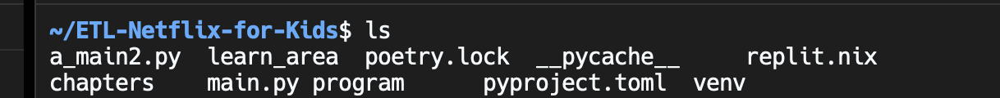
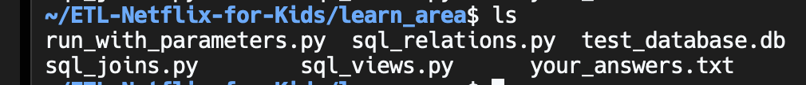
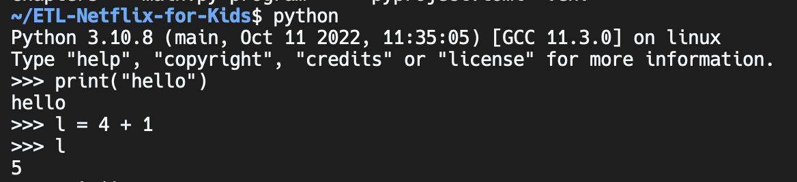

# Lesson plan
  
  ** this file should contain teacher lesson plan details ** 

  __ students will never see this __

  ## Learning Objectives
  1. 
  2. 
  3. 

  Use [Markdown](https://gist.github.com/cuonggt/9b7d08a597b167299f0d) to format your lesson plan.

  For example, here is a code block in python3
```python
def hello_world():
  print("hello world!")
```


# ARCHIVE

## 

We now have finished the main logic of the ETL. Our result can now be used for a recommendation system. 

We now how a python program that calculates the popularity of the shows after you RUN the program. If we RUN the program again, the result will be almost exactly the same. This is because in our learning project all the data we use is static and most data doesnt change. The only thing that might change is the gdp_

Its very rare, that we have an ETL and the data is not changing. I would actually not call it a "real" an ETL then.

A "real" ETL runs for example once a day. Every day there might be some new data. Some data might have changed or removed. Thats why every day the result will also change.

So far, we only used the data from one day. Now we want to rewrite to program a little bit. The program should have an input argument. The input argument should be the day for which we want to import and transform the data.

Now imagine the following. Every day the data we use changes


So, we now need to learn:
1) How to run our program from the shell
2) How to add a parameter to our program (the day)
3) How to rethink our ETL logic


## Linux commands in Shell

1) open the shell


There is a differnce between a shell and a terminal. But this is not important for us at this point. Everytime you see a "shell" or a "terminal" you can do the following things:
- you have a simple window where you can execute in linux commands
- you always see the path where the shell/terminal is located and will execute the commands 

When using the shell it is very important to see in which directory the shell is right now. In this case we are at the root directory of our project: ~/ETL-Netflix-for-Kids


Now we lets use the linux command "ls" which shows all the files inside this directory. We now see all the files and directories. We also see some files which are invisible for our file bar on the left.


Now we can also go inside a directory. For example lets go into the directory "learn_area". For that type in "cd learn_area".:
```bash
cd learn_area
```

You will see that we now are in the directory "~/ETL-Netflix-for-Kids/chapter"

Then lets execute "ls" to see which files we have here:
```bash
ls
```

You will now see the files inside (there might be some changes since i made the screenshot). You can compare what you see with the "Files" bar on the left side.



## Run Python interactive shell
We can now also execute different programs that are installed here. One program is "python". 

Python provides an interactive shell. Its basically the "Console" that you already use. Here we can just type in python commands all the time and see the result.

To open this just execute the command "python" in the shell.
Now it shows you the Python version it opened and you can start using python commands:


You see, his is basically the same logic like when you use the "Console". Now lets exit the interactive shell again with the command exit().


## Run python program from shell

Until now we have started our python program by using the green "RUN" button. This was invented by Replit, so its easier to use. But now lets learn how you usually start a python program.


Now we want to run our python program "main.py", without using the green "RUN" button.

BUT: Right now we are in the directory "learn_area". But we need to go one directory above, where the file is. For that we can use the command:
```bash
cd ..
```
Now we should be in our root directory "~/ETL-Netflix-for-Kids" again. Check with "ls" if you now can see the "main.py" file now.

Lets now run our python program. For that we type in "python" and then the name of the file that we want to execute. We now want to execute the "main.py" file.
BUT: For that we have to be in the directory where the "main.py" file is.

In this example it would be:
```bash
python main.py
```

## Run program with input arguments
Now we want to learn, how to run the python program with input arguments. 

### TASK 16 (LEARNING):
- Check out the official documentation how to use arguments: https://docs.python.org/3/library/argparse.html
- Check out this guide: https://towardsdatascience.com/a-simple-guide-to-command-line-arguments-with-argparse-6824c30ab1c3
- create a python program in the file "run_with_parameters"
- use the module "argparse" to add 3 input arguments
- one of those arguments should be optional, 2 should be required.
- the python program then should print those 3 arguments


## Run program for different days

### TASK 17 (PROJECT):
- Add an input argument to our program which expects a day as a string (e.g 2022-20-01)
- Import: The ETL should now only import and save data from the day of the argument. For that add a "day" column in our sql tables.
- Transformation: Here the ETL should read data from ALL days of our sql tables.
- Result: For our result (shows, popularity) we now add one more column "day". The data should not be overwritten, but added.
- So, as the end we have the popularity of every day.
- Execute the program 3 times. Once with each of the following parameters: ("2022-06-01", "2022-06-02", "2022-06-03")


## Do we have a real "ETL" now?
We are almost there. The only thing that is missing now is a program which once a day runs and executes the script for the specific day. There are different programs that can be used for that. For example a CRON job. But one of the most popular scheduling programs is Airflow. How to use it, we will learn soon.


# Chapter 12) Create Bash Script
This is a "bonus" chapter.
We now want to write a bash script, which will execute our program for each of the 3 days in a row.

But first lets learn what a bash script is.

First of all you need to create a file, with the ending "sh" for example the file in "learn_area" with the name "test_bash.sh".
Inside this file you that just put in all linux commands. In the shell script you can also use variables. Here are the commands inside the file "test_bash.sh".

```bash
# this is a bash script.
ls
name=peter
echo "---------"
echo "his name is" $name 
```

Now run the bash file. Make sure you are in the shell and in the directory "learn_area". Then execute the following command:

```sh
bash test_bash.sh
```

As you can see, all the commands in the script where executed. First "ls" shows us all files. Then the name "peter" is stored in the variable "name". Then we have some "echo" which is like "print" in python.


### TASK 18 (LEARNING):
Now write your own bash script.
- write bash commands inside the file "bash_script.sh"
- The bash script should: create 3 variables with a value: name, age, job
- it should run our python program "run_with_parameters" with the 3 variables as an argument
- run the bash script.

### TASK 19 (PROJECT):
Now its time to add a bash script this to our project. Remember, we executed our program with 3 different days.
- write a bash script which executes our program for each of the 3 days.
- execute the bash script


# Run Program with Parameters
# run program with parameters

import argparse


def etl(day):
  print(f"starting etl for execution day: {day} ")


def main():
  args = get_arguments()
  print(args.name)
  print(args.age)
  print(args.job)


def get_arguments():
  # Create an ArgumentParser object
  parser = argparse.ArgumentParser(description='Description of your program.')

  # Add input arguments
  parser.add_argument('--name',
                      type=str,
                      help='Description of argument 1',
                      required=True)
  parser.add_argument('--age',
                      type=str,
                      help='Description of argument 1',
                      required=True)
  parser.add_argument('--job', type=str, help='Description of argument 1')

  # Parse the input arguments
  args = parser.parse_args()
  return args


if __name__ == "__main__":
  main()


# Bash
# this is a bash script.
ls
name=peter
echo "---------"
echo "his name is" $name 

# Run program with Bash