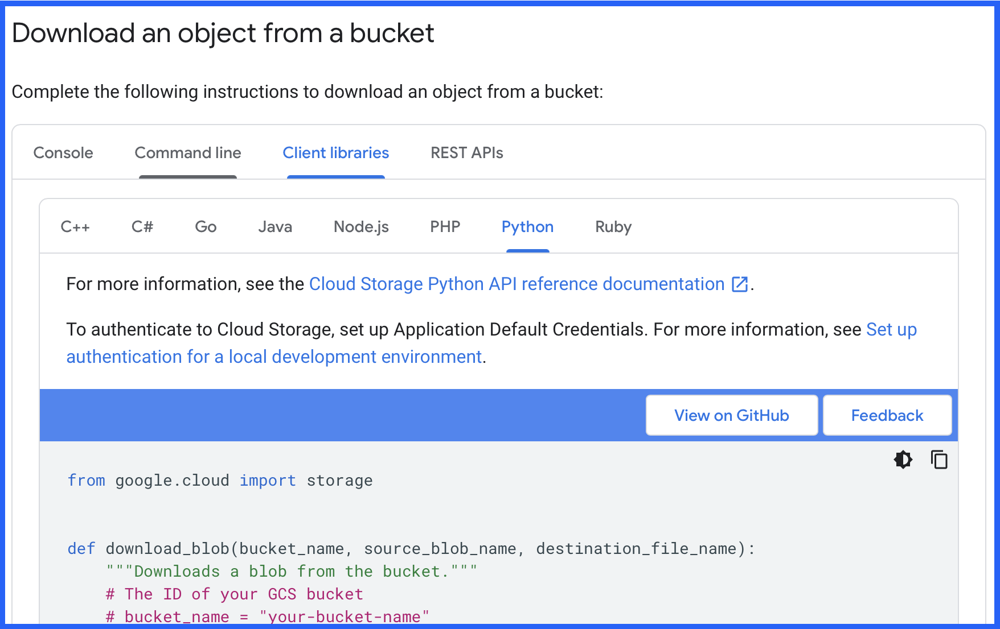
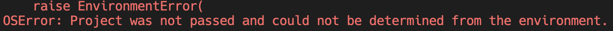
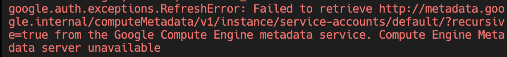

# GCP Storage
First of all we are going to explore the most simple service: Storage. what is it? Like the name says its a service from GCP where you can store files. 
I created a GCP account and uploaded a file into GCP storage. Now you are able to download this file. But in order to download it you need 3 informations.

1) The path where to find the file
2) Permissions to read and download this file
3) A Python library to execute the download

### 1) Path of the File
Imagine GCP Storage works like the directory on your computer. So we need the "directory" where to find the file and the name of the file. To locate a file in GCP storage you need:
- Project Id: This is where all the GCP resources of a specific project are bundled
- Bucket name: Think about it as the directory on the first level. That where we start to look.
- File path: This is the excact path of the file inside the bucket.

So now you can say to google: Look into the project "python-rocket-1". Go into the bucket "python-rocket-source-data-4s23" and give me the file "etl-placement-report/test.csv".

### 2) Authorization
Now you have the information where to get the file. But you dont have the permissions yet to read it. 
Me, who created this bucket and file can control who is allowed to read this file.
There are different authorization concepts, we will learn about more later. Just keep in mind, that you always have to think, am i authorized to execute this action (for example read and download this file).

One way to authorize yourself is by usinf a "service-user". Think about it as a json file where the username and the password is stored.  You can find the file with the service-user here: "learning_area/1_GCP/service_user_read_file.json".
I gave this "service-user" the permissions to download this file. So everyone who has this file (with username and password) is able to download the file.

### 3) Python Library
Now we can download this file with different programming languages. Since we write in Python, we want to use the library to interact with GCP Storage. This Python library uses the term "blob". It stands for "binary large object". In other terms, its a file stored in binary. You will see it in the following task.

## Download file from GCP Storage
### TASK 1 (PROJECT):
- Read the official GCP documentation how to download a file from GCP storage and use the python code as a first template: https://cloud.google.com/storage/docs/downloading-objects#client-libraries-download-object
This code here:

- Use this function in our main file.
- Define the 3 parameter which are used in the function. There are explained in the function.

1) bucket name is: "python-rocket-source-data-4s23"
2) gcp file path is: "etl-netflix/netflix_content.csv"
3) destination path: program/data_sources

- Execute this function. If everything went well, you now should get a permission error. Because you still dont have the permission to read the file. The error should look like this:

### TASK 2 (PROJECT):
Now we need to adjust the code, to specify the project id. GCP needs this information to know where to search for the bucket and the file. In function to download the file, we use this command:
"storage.Client()". This creates the connection the GCP storage. Now we need to add the project id as a parameter. 
- Check out the documentation about the method "Client()": https://gcloud.readthedocs.io/en/latest/storage-client.html
- Now use the projectid: "python-rocket-1" and execute the code again.
If you did everything right now you should get a NEW error which looks like this:

The error message is (like often) not saying much. But the error appears basically because we didnt authorize ourselves, so we still have no permissions to download the file.

### TASK 3 (PROJECT):
Now we need to add authorization in our code. I told you before that on way is to use a json file with the credentials of a service-user.

- Check the documentation again and first figure out if our method "storage.Client()" has a mechanism for authorization.
- Read this documentation and figure out how to read our service account file ("service_user_read_file.json") and store the credentials in a variable: https://googleapis.dev/python/google-auth/1.7.0/user-guide.html
- Now use this variable with our credentials in our code to authorize us.
If everything worked, you now should have no errors anymore. Also the file should be exported and you should see it in your file system.