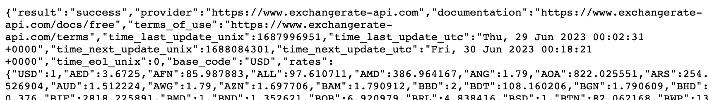
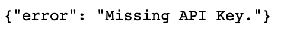

# Read from API

# What is an API?

## Analogy
Here is the most used analogy, so you get a first intuition what an API is:

An API is like a waiter in a restaurant. When you go to a restaurant, you don't go directly into the kitchen and cook your own meal. Instead, you interact with the waiter who serves as an intermediary between you and the kitchen.

## Usage of APIs
There are a lot of technical explanations. But lets first keep it simple.

Lets see, how to use an API.

When you open your browser and for example type in this url: https://open.er-api.com/v6/latest/USD

Then you dont see a website, like usually. Instead you now get a result that looks like this:

What happend? You sucessfully called your first API and received a response.

So, what happens in the background? The API is a program which is running on a server. The program can be reached over a specific url (in this case: https://open.er-api.com/v6). In our example you see, that we also added to the url "latest/USD".
This is called an endpoint of an API. By calling this specifiv endpoint we tell the API that we are interested in the latest exchange rate for the USD. This is why as a response we get a json, where we see all the exchange rates for the USD.

If we now for example want the exchange rate for the EUR, we call this endpoint:
https://open.er-api.com/v6/latest/EUR

When interacting with an API we need to know which different endpoints are available and which information we get from there. This is why every API should have a documentation where it shows how to interact with it.

## Usage of APIs (from a program)
In this example we used the browser to call an API. In most cases we will call the API from our program. So, we will write python code, which will call this endpoint and then receive a response.
Almost with every programming language you can call an API.

## Programming an API

### Hosting
So, how was this API created and how does it work?
In general you can create an API in many different programming languages, like Python.
For Python there are popular frameworks like: fastapi, flask, flacon, django.

So, you create for example an API by writing Python code and using the module fastapi. As a next step you need to make the API accessible over the internet. Thats why you need to expose it to a URL. Then it can be reached by everyone using this URL.

### Logic
In the python code for your API you create the logic of the API.
1) You define different endpoints (e.g: https://open.er-api.com/v6/latest/EUR)
2) You create a logic: Everytime somone calls this url you start a function in your python code, e.g: "get_exchange_for_euro()".
3) The function then for example connects to your sql database, where you have stored the current exchange rate.
4) The result from the sql database is then transformed into a json and is send as a response back to the user.

### Benefits
So, what are the benefits of the API?
The API is a middleman between the user and the data. The user doesnt need to connect to a database, find the right tables and format the result. The user only has to know which endpoint (url) he has to call. The API then handles everything for him.

### Authorization
In this example we used a public API with no authorization. This means, everyone can call this API. Usually an API requires some kind of authorization. This can be a username and a password. But the most common approach is to have a API-KEY. This is like a password that you send with your request.

This api for example requires authorization.(https://api.api-ninjas.com/v1/animals?name=dog)

When you call it you receive an error message:

### Accessibility
The APIs we will use are accessible for everyone. Some of them dont require any authorization and some require an authorization. But in general there are open to the use for all people and programs.

But the most APIs are only used internally inside a company. For example when you open the Instagram app. The app then calls one of the instagram APIs. For example they migh have an API, that handles to get the newest instagram stories and send it to your instagram app.
In this case, you as a user dont use this API. Its used inside the instagram architecture.

### Benefits of an API
So, here is a list of the most important benefits of creating and using a good APIs:

1. Middleman: APIs help different services (programs) to communicate with each other. Its like a common language every service understands.
2. Authorization: APIs can check what a specific user is allowed to see.
3. Hide Complexity: As a user of an API you dont need to understand the backend, foe example the sql database. 
4. Easy to use: Calling a url is easy. Thats why it is very easy to integrate in your program.
5. Scalable: When its hosted properly it can handle many requests in parallel
6. Documentaion: Every good API should have a good documentaion. To use it you dont need to talk to tis developer or see the API code.
7. Accessible via https: This means, that you can call an API like you call any other url on the internet.

### Programming an API?
Creating an API also is part of the work of a data engineer. So, later you will learn how to create and host an API. But for know, we concentrate on how to use APIs.

# Back to our Netflix Project
Remember, we want to optimise the content for kids on netflix.
The research team from Netflix figured out, that movies which where produced in countries with a lower GDP/capita (Gross domestic product per person), are not so popular for most kids.

In our data we already find the name of the country where the movie was produced. Now we stil need the information about the GDP/capita of those countries. To get this information, we will call a free API.

### Task
- Check out this video: https://www.youtube.com/watch?v=OVvTv9Hy91Q
- Create Account at ninja APi
- Check out the doc https://api-ninjas.com/api/country
- Use pandas to read the csv "netflix_shows" and to get all countries.
- For every country call the API and get the GDP/capita.
- Create a CSV with the name "countries_gdp.csv" where you have for each country its GDP/capita value.

