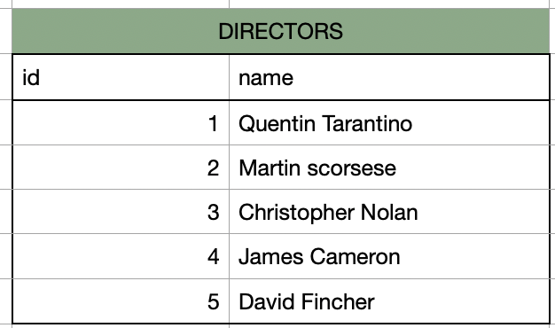
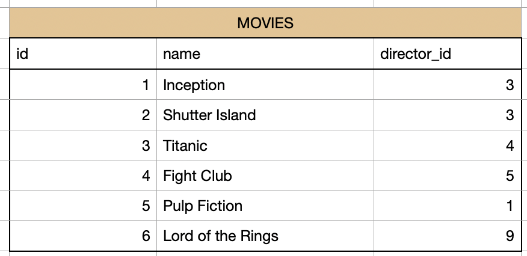

# Save data in SQL

You already know how to save a table in a SQL database. Now we want to add some more knowledge about SQL tables.

One of the big benefits of a SQL database is that it is a "relational" database. What does that mean? 
It means that in SQL we have to define relations between different tables. This can give the user a better understanding how all the data is related. And it also makes the process of searching or changing data much more efficient.

# SQL relations

Imagine we have 2 tables.

Table 1: "DIRECTORS"

Table 2: "MOVIES"

Now how are those 2 tables related?
You can see, that the table "MOVIES" has a column "director_id". With this id we can look into the table "DIRECTORS" and figure out the director name. For example the movie "inception" has the director_id "3". In the table "DIRECTORS" we search for the id "3" and find the name "Christopher Nolan".

SO the first thing that we figured out is that that both tables are related through those cloumns:
MOVIES.director_id <--> DIRECTORS.id

Now as a next step, we want to know more about the relationship. In general here are the relationship types:
- 1 <--> n (1 to many)
- n <--> 1 (many to 1)
- n <--> n (many to many)
- 1 <--> 1 (1 to 1)

Lets check out our tables. One movie can only have one director. But one director can have many movies (e.g Christopher Nolan).
Thats why we have the following relationship:

- MOVIES.director_id <--> DIRECTORS.id
- n <--> 1 (many to 1)

## SQL Keys (Primary, Secondary)

Primary Key: A primary key is a column which has only unique values. One value cant be twice in the same column. The value of the primary key ifentifiies exactly one row of the table. It is usually a number in most cases an ID.

So, what is the primary key in both tables?
In the first table "DIRECTORS" its very easy. The primary key is the column "id".

In the second table its more complicated. We have two columns with an id. So, which one is it?
The column director_id sounds like an "id". And it also has numbers. BUT: We see, that the id is not unique here in this table. For example the id "3" we have in the first and second row. The column "director_id" is the column that we use to connect to the table "DIRECTOR" whre the same number is the primary key.
This is way the column "director_id" in the table "DIRECTOR" is a foreign key.

Foreign key: A column which makes it possible to connect to another table where the same column is a primary key.

So, to summarize. In our example:

Primary keys:
DIRECTORS.id
MOVIES.id

Foreign keys:
MOVIES.director_id

Relation:
MOVIES.director_id <--> DIRECTOR.id
n <--> 1 (many to 1)

In SQL there is a way how to visualise relations between tables. Here is a visualisation of the example you just created. We see 2 tables and their columns. The key symbol shows you the primary key. The arrow shows which columns are connected. The 1-n shows or one to many relationship.

## SQL Relations Tasks

_**TASK 5 (THEORY):**_

I already explained you the main concepts of relationship. But in addition to that here is more material.
- Check out this video here:  https://www.youtube.com/watch?v=4q-keGvUnag
- Explain with your own words and write it in learnarea/your_answers.txt: what are relations? what are the primary key and foreign key? which relation types we have between 2 tables? Use the knowledge from my explanation and the video.

_**TASK 6 (CODING):**_

Now lets test the knowledge and create your own relations between tables:
- Check out this documentation about how to create a primary key in a table: https://www.techonthenet.com/sqlite/primary_keys.php
- Check out this documentatoin about how to create a foreign key in a table: https://www.sqlitetutorial.net/sqlite-foreign-key/
- Open the file learnarea/sql_relations.py and follow the instructions.

_**TASK 7 (PROJECT):**_
Now lets continue on our ETL project. 
- Create a SQL table for each of the 3 csvs, with the names (NETFLIX_SHOWS, NETFLIX_METADATA, RATINGS)
- Make sure to create Primary and Seconday Keys
- Insert the data into the tables.
- In the end you should have 3 tables wwith relations.
- Create a diagram for the sql relations and save the image in the folder "graphics". For that you can use some drawing tool or for example a free tool like: https://app.diagrams.net There are many other more modern free tools where you just need to create an accoun. Or you just use paint, powerpoint..

