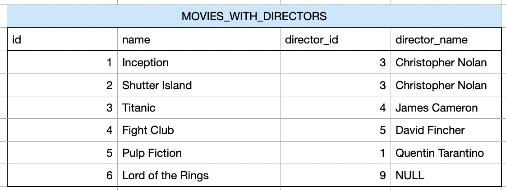
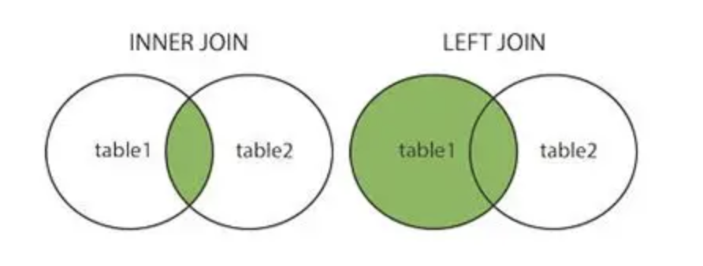
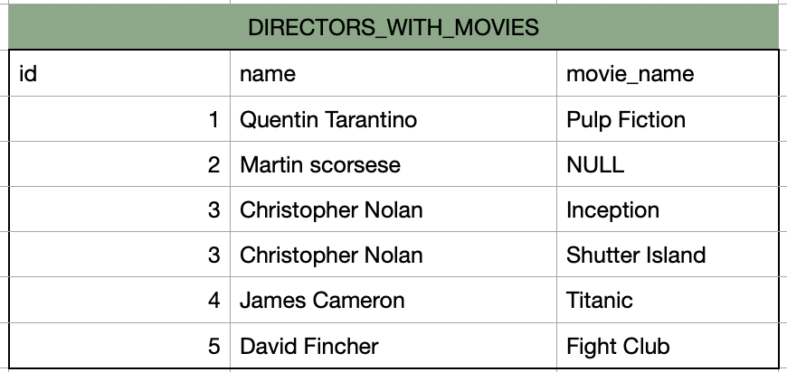
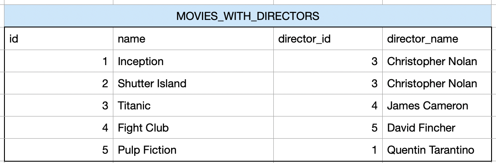
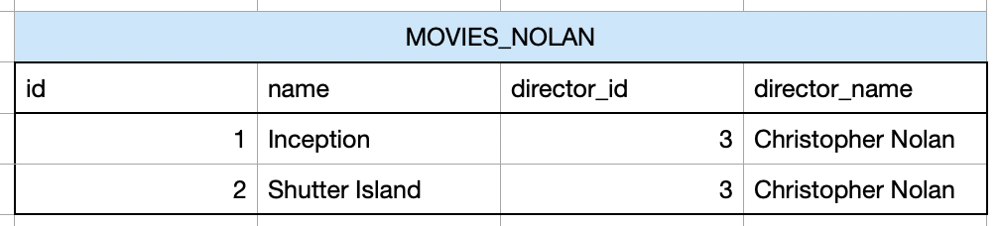
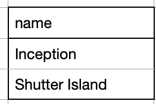

# Save data in SQL

You already know how to save a table in a SQL database. Now we want to add some more knowledge about SQL tables.

One of the big benefits of a SQL database is that it is a "relational" database. What does that mean? 
It means that in SQL we have to define relations between different tables. This can give the user a better understanding how all the data is related. And it also makes the process of searching or changing data much more efficient.


# SQL relations

Imagine we have 2 tables.

Table 1: "DIRECTORS"


Table 2: "MOVIES"


Now how are those 2 tables related?
You can see, that the table "MOVIES" has a column "director_id". With this id we can look into the table "DIRECTORS" and figure out the director name. For example the movie "inception" has the director_id "3". In the table "DIRECTORS" we search for the id "3" and find the name "Christopher Nolan".

SO the first thing that we figured out is that that both tables are related through those cloumns:
MOVIES.director_id <--> DIRECTORS.id

Now as a next step, we want to know more about the relationship. In general here are the relationship types:
- 1 <--> n (1 to many)
- n <--> 1 (many to 1)
- n <--> n (many to many)
- 1 <--> 1 (1 to 1)

Lets check out our tables. One movie can only have one director. But one director can have many movies (e.g Christopher Nolan).
Thats why we have the following relationship:

- MOVIES.director_id <--> DIRECTORS.id
- n <--> 1 (many to 1)


## SQL Keys (Primary, Secondary)

Primary Key: A primary key is a column which has only unique values. One value cant be twice in the same column. The value of the primary key ifentifiies exactly one row of the table. It is usually a number in most cases an ID.

So, what is the primary key in both tables?
In the first table "DIRECTORS" its very easy. The primary key is the column "id".

In the second table its more complicated. We have two columns with an id. So, which one is it?
The column director_id sounds like an "id". And it also has numbers. BUT: We see, that the id is not unique here in this table. For example the id "3" we have in the first and second row. The column "director_id" is the column that we use to connect to the table "DIRECTOR" whre the same number is the primary key.
This is way the column "director_id" in the table "DIRECTOR" is a foreign key.

Foreign key: A column which makes it possible to connect to another table where the same column is a primary key.

So, to summarize. In our example:

Primary keys:
DIRECTORS.id
MOVIES.id

Foreign keys:
MOVIES.director_id

Relation:
MOVIES.director_id <--> DIRECTOR.id
n <--> 1 (many to 1)


In SQL there is a way how to visualise relations between tables. Here is a visualisation of the example you just created. We see 2 tables and their columns. The key symbol shows you the primary key. The arrow shows which columns are connected. The 1-n shows or one to many relationship.


## SQL Relations Tasks

_**TASK 5 (THEORY):**_

I already explained you the main concepts of relationship. But in addition to that here is more material.
- Check out this video here:  https://www.youtube.com/watch?v=4q-keGvUnag
- Explain with your own words and write it in learnarea/your_answers.txt: what are relations? what are the primary key and foreign key? which relation types we have between 2 tables? Use the knowledge from my explanation and the video.


_**TASK 6 (CODING):**_

Now lets test the knowledge and create your own relations between tables:
- Check out this documentation about how to create a primary key in a table: https://www.techonthenet.com/sqlite/primary_keys.php
- Check out this documentatoin about how to create a foreign key in a table: https://www.sqlitetutorial.net/sqlite-foreign-key/
- Open the file learnarea/sql_relations.py and follow the instructions.


_**TASK 8 (PROJECT):**_
Now lets continue on our ETL project. 
- Create a SQL table for each of the 3 csvs, with the names (NETFLIX_SHOWS, NETFLIX_METADATA, RATINGS)
- Make sure to create Primary and Seconday Keys
- Insert the data into the tables.
- In the end you should have 3 tables wwith relations.
- Create a diagram for the sql relations and save the image in the folder "graphics". For that you can use some drawing tool or for example a free tool like: https://app.diagrams.net There are many other more modern free tools where you just need to create an accoun. Or you just use paint, powerpoint..


# SQL Joins: How to combine the tables
Now back to our learning example. We have the 2 tables "DIRECTORS" and "MOVIES". We already know the relations. But now we want to combine their data.

In SQL you combine tables by using JOINS. There are endless tutorials about JOINs. Feel free to check them if you want or need a deeper understanding. At this point i will tell you only as much as you need to continue.

In SQL there are different JOINS. The most important once that you need to know at this moment:
1) LEFT JOIN
2) INNER JOIN


Remember our tables:

Table 1: DIRECTORS


Table 2: MOVIES


### SQL LEFT JOIN

Now lets say, we want to know for every movie the name of the director. In table 1 we have the name of the director. But in table 2 only the ID.

In the end we want a result which looks like this. Here you we see every movie and the name of the director of the movie. We also see 2 more things:
1) Every row from the table "MOVIES" is still there.
2) For the movie "Lord of the Rings" we didnt find a director_name. So, there we have a NULL value. 




The right graphic illustrates a LEFT JOIN. table1 is our "MOVIES". and table2 is "DIRECTORS"


So, how can we combine both tables together like this in SQL?

Yes, with a JOIN. More concrete a LEFT JOIN Here is the command we need to execute to get the resulting table:

```sql
SELECT m.id, m.name, m.director_id, d.name as director_name
FROM MOVIES as m
LEFT JOIN DIRECTOR as d ON m.director_id = d.id
```

What does this query do? This is how you should read it:
1. We select our first table "Movies" with "FROM Movies".
2. Then we decide which other table we want to JOIN. In this case we JOIN "DIRECTOR" with "LEFT JOIN DIRECTOR".
3. We say please join the tables where the column "director_id" from the table "MOVIES" equals the column "id" from the table "DIRECTOR" (m.director_id = d.id). Remember here we have our relation.
4. WITH the "SELECT" we define which columns of each tables we want to display.


Lets take a look back at our table. In our case of the LEFT JOIN the table "MOVIES" is on the left. This is always the table that we call after the "FROM".
- All the rows from the left table will still be in the result.
- When a row from the left table has cant find any value (in this case Lord of the Rings cant find a director name) we get a NULL value.

### LEFT JOIN (the other way around)
You might have realised that we lost some data when we did that join. We cant see the director "Martin scorsese" with the id "2" anywhere in our result table. This is because no movie of the "MOVIES" table has the director_id "2" for "Martin scorsese".

Lets say we now want it the other way around. We want to make sure to see all directors. And for ever director we want to join the movies they directed.

We want a table that looks like this. Here you can see:
1) We hav every director, even Martin scorsese.
2) For Martin scorsese there is no movie, so there is a NULL value for the column "movie_name"
3) We now have 2 rows with the direcor "Christopher Nolan". This is because we have 2 movies that he directed.



This would be the query:
```sql
SELECT d.id, d.name, m.name as movie_name
FROM DIRECTOR d
LEFT JOIN MOVIES m ON d.id = m.director_id
```

1) We now change the order of the tables. Now "DIRECTOR" is on the left.
2) We join still with the same condition.
3) We choose other columns that we want to display


### SQL INNER JOIN

As you can see in the first LEFT JOIN we would still have the movie "Lord of the Rings" even though it has no director. 

In the second LEFT JOIN we would still have the director "Martin scorsese" even though he has no movie. 


But know lets say, we want only rows where we find a match in the other table. We dont want those 2 cases with NULL values.

We want this result:



For that we need to use a INNER JOIN. The query will look like this:
```sql
SELECT m.id, m.name, m.director_id, d.name
FROM MOVIES m
INNER JOIN DIRECTOR d ON m.director_id = d.id
```
1) Everything is like in the first LEFT JOIN example. The only difference is that we now use "INNER JOIN" instead of "LEFT JOIN".
2) When using an INNER JOIN it doesnt matter which table is on the left or on the right. You can change the tables and still get the same result.

## SQL JOIN Tasks

_**TASK 9 (CODING):**_
Now you will do your own JOINS. 
- Go through the file file learnarea/sql_joins.py


_**TASK 10 (PROJECT):**_
Now lets use JOINS in our ETL project.
- Create a new table "NETFLIX_META_WITH_RATING". For that JOIN 2 of the tables so we get the follwing: We want all rows and columns from the table "NETFLIX_SHOWS". But for the column "ratings" instead of the number we want the actual name of the rating.
- JOIN 2 of the tables


# SQL VIEWS
Think of a view as a saved query that you can treat as a table.
Lets say you use the inner join from above. But this time we also add a "WHERE" condition. We want to filter for movies from "Christopher Nolan":

```sql
SELECT m.id, m.name, m.director_id, d.name
FROM MOVIES m
INNER JOIN DIRECTOR d ON m.director_id = d.id
WHERE d.name = "Christopher Nolan
```

The result would look semething like this. We would have only those 2 rows.


Now we could take the result and load it into a pandas datafram and then work with the data. But lets say, we want to execute the JOIN many times, for example once a day. 

We can save the SQL query in a view. Lets first check the code. It is the same sql query. we just added "CREATE VIEW MOVIES_NOLAN AS". 

```sql
CREATE VIEW MOVIES_NOLAN AS
SELECT m.id, m.name, m.director_id, d.name
FROM MOVIES m
INNER JOIN DIRECTOR d ON m.director_id = d.id
WHERE d.name = "Christopher Nolan
```

What will happen?
Now in your database you with the command "show tables;" you will see something that looks like a table with the name "MOVIES_NOLAN".



You can now use it as if it is a table. You can for example use this query:

```sql
SELECT name
FROM MOVIES_NOLAN m
```

And you will get:


So, what makes a view different then a table?
We dont store the data of the view. We only store the sql query. Only then when we query the view, the sql query of the view will be executed.

_**TASK 9 (CODING):**_
