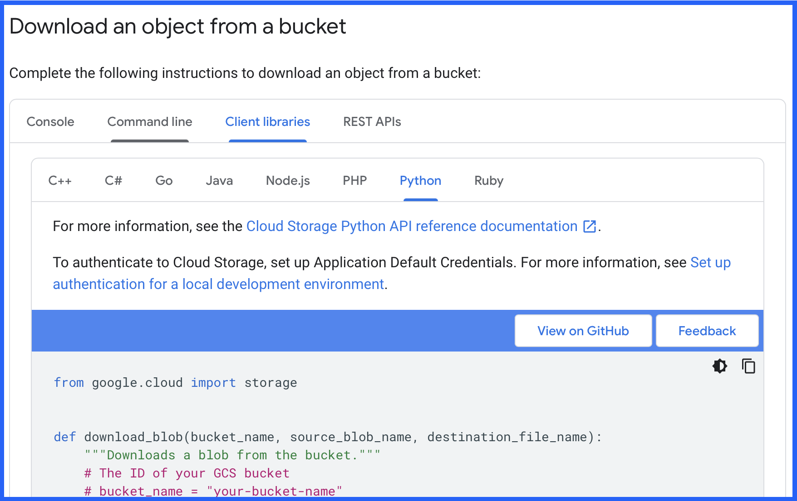
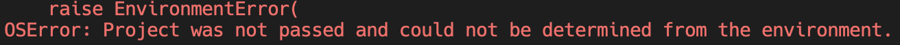

# Cloud Platforms

## What are cloud platforms and why use them?
Imagine you write a python program which should run once a day and make some data transformations. What do you need before getting started?
1) Hardware: You need a computer where you can install and run your python program
2) Software: You need to install a new version of Python on your computer. Also install other libraries like pandas, requests and so on.
3) Maintaing: You need to make sure your hardware doesnt break and your software is always updated.

Now Cloud Platforms can help us with all of those 3 components. 
Cloud Platforms have big computing and data centers. There have basically thousends of computers ready to work.

So now imagine instead of running your python program on your computer you let it run on a computer on a cloud computer. What are the benefits?
1) Your computer could break, get stolen. A cloud computer is save from damage.
2) Your computer GPU and memmory is limited. If you have a complicated program which needs a lot of ressources, your computer might be not good enough.
3) Coud platforms also manage software for you. They can give you access to a computer which already has installed everything you need.
4) If the software need updates, they take care of it.

So basically, you can outsource hardware and software infrastructure almost completely. The only thing you need is a internet connection to access it.

## Companies using cloud platflorms
Of course for a single person, with a single python program there is no necessity to use a cloud platform.
But now imagine you are a big company with many databases, programs, AI models. You need to buy all the computers and put them in your office, or somewhere. Then you need an IT department which makes everything work, installs and maintains all the software. Those are a lot of fix costs and a big initial investment. Also its not very scalable. If you suddenly need much more or much less ressources you are not very flexible to adjust.

Here is a good video which explains the benefit of using cloud services instead of on premise solutions:
https://www.youtube.com/watch?v=1ERdeg8Sfv4

## Cloud Platform Provider

Now you know what the general concept of a cloud platform is. There are endless different cloud platforms. But there is a handful of big and most popluar cloud platforms
1) AWS
2) GCP
3) Azure
4) IBM

All of them offer basically very similiar services. But all of them have some benefits. While AWS is the most used platform, GCP is more user and beginner friendly and the best way to get started.

## GCP (Google Cloud Platform)

So, we are going to work with GCP.
GCP has different services which offer you to some degree hardware, software and maintanance and an easy interface.

Some important solutions for a data engineer:
1) Storage: A service to store files.
2) Big Query: A scalable database for BIG Data
3) Composer: A service which helps you to schedule your ETL tasks (Airflow).

## Storage
First of all we are going to explore the most simple service: Storage. 
I created a GCP account and uploaded a file into GCP storage. Now you are able to download this file. But in order to download it you need 3 information.

1) The path where to find the file
2) Permissions to read and download this file
3) A Python library to execute the download

### 1) Path of the File
Imagine GCP Storage works like the directory on your computer. So we need the "directory" where to find the file and the name of the file. In GCP storage you need
- Project Id: This is where all the GCP resources of a specific project are bundled
- Bucket name: Think about it as the directory on the first level. That where we start to look.
- File path: This is the excact path of the file inside the bucket.

The project id is: "python-rocket-1"
The bucket name is: "python-rocket-source-data-4s23"
The file path is: "etl-placement-report/test.csv"

So now you can say to google: Look into the project "python-rocket-1". Go into the bucket "python-rocket-source-data-4s23" and give me the file "etl-placement-report/test.csv".

### 2) Authorization
Now you have the information where to get the file. But you dont have the permissions yet to read it. 
Me, who created this bucket and file can control who is allowed to read this file.
There are different authorization concepts, we will learn about more later. Just keep in mind, that you always have to think, am i authorized to execute this action (for example read and download this file).

One way to authorize yourself is by usinf a "service-user". Think about it as a json file where the username and the password is stored.  You can find the file with the service-user here: "learning_area/1_GCP/service_user_read_file.json".
I gave this "service-user" the permissions to download this file. So everyone who has this file (with username and password) is able to download the file.

### 3) Python Library
Now we can download this file with different programming languages. Since we write in Python, we want to use the library to interact with GCP Storage. This Python library uses the term "blob". It stands for "binary large object". In other terms, its a file stored in binary. You will see it in the following task.

## Download file from GCP Storage
_**TASK 1:**_
- Read the official GCP documentation how to download a file from GCP storage and use the python code as a first template:
- link: https://cloud.google.com/storage/docs/downloading-objects#client-libraries-download-object
This code here:

- Use this function in our main file.
- Define the 3 parameter which are used in the function.
- Execute this function. If everything went well, you now should get a permission error. Because you still dont have the permission to read the file. The error should look like this:

_**TASK 2:**_
Now we need to adjust the code, to specify the project.
