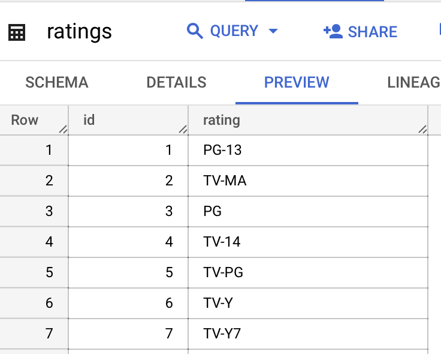

# Big Query

You should be already familiar that we can store data in a sql database.

Gcp has a very popular service which looks and works very similiar as a sql database: Its called: Big Query.

## Lets check out how Big Query looks like

In this case we see a dataset with the name "etl_netflix" and a table with the name "ratings". We can group many tables in one dataset.

Lets take a look into our table called "ratings".
You see it looks like a sql table or a pandas dataframes. You have columns and you have rows. In this case we have 2 columns (id and rating)

You can even query the table with SQL queries you already know.
Here the SQL query:

Here the result:

You see that you can use Big Query AS IF it is a normal sql database. You have tables, with columns and rows. You can use most SQL operations that you know in order to query this data. Also, you dont have to install any software of setup anyting. You can just start to create tables with data right away.

## What happens under the hood?

But, under the hood a lot of magic happens. Especially in use cases where you have BIG DATA (Terrabytes of data) a SQL database can come to its limit and not perform well. Big Query can handle large datasets very easily. The resources used are scaled automatically. So in theory you have endless computing power. 
Also it is a manged service, so you dont need to take care of the sofware underneath or worry about updates and infrasturucture.
!BUT: You have to be careful because of possible high costs. When you accidentally make a very complicated data on huge datasets this can cost a lot of money. In our lesson we only use small data and standard queries.

_**TASK 4:**_

We will now use pandas, to read directly from a big query table.
Information you need:

- Use pandas to read the big query table "ratings" from the dataset "etl_netflix" from the project "python-rocket-1". Store the dataframe as a csv here: "data_sources/ratings_data.csv"
- Check out the documentation how to use pandas to read directly from a big query table: https://pandas.pydata.org/docs/reference/api/pandas.read_gbq.html
- Check out an example Query here: https://cloud.google.com/bigquery/docs/samples/bigquery-pandas-gbq-read-gbq-simple
- Here again we need to add authorization. For that use the service user "chapters/1_GCP/service_user_read_bigquery.json". Use the same approach like with GCP Storage.

